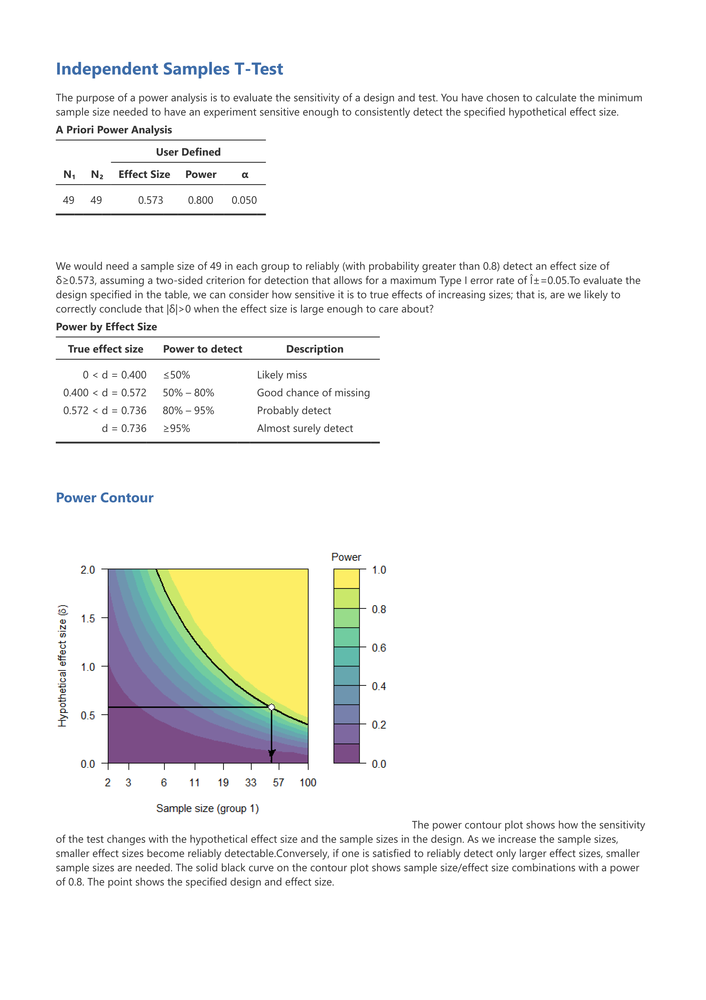

# 可重製的研究設計 {#case}

在第\@ref(intro)章，我們已經了解實驗程序的每一個環節，都存在左右產出知識品質良窳的因素。學習心理學實驗研究方法的重點除了熟悉運用隨機化程序，以及降低實驗結果裡混淆變項的比例，現在還有公開實驗方法與資料的思維與操作方法。開放方法與資料可保障實驗流程完全按照事前計畫處理，這是我們要學習預先註冊(Preregistration)的重要理由。

我們先來認識一件研究案例的關鍵情節，這些關鍵情節會是你進行任何研究可能遇上的真實狀況。再從關鍵情節提出一些延伸問題，讓讀者經由個人反思，或著經由現場或網路相互討論，自行判斷研究可重製的真正價值。

## 案例介紹 {#case_intro} 

```{r mayes_dataanalysis, message=TRUE, warning=TRUE, include=FALSE}
library(dplyr)

## Import the three data set to R

## Get path
"analysis/" %>% paste0(".csv$" %>% list.files(path = "analysis")) %>% 
setNames( ## Get name
paste0(".csv$" %>% list.files(path = "analysis")) %>% gsub(pattern = "*.csv$", replacement = "") %>% make.names()) %>% 
  lapply(read.csv) %>%
  list2env(envir = .GlobalEnv)

## T test of mayes_study1
mayes_study1_test <- mayes_data_study1 %>% with(t.test(Score ~ desc(Condition), var.equal = TRUE)) %>%
  papaja::apa_print.htest()
  ##unlist() 

##$t(`r mayes_study1_test["parameter.df"]  %>% as.character()`) = `r mayes_study1_test["statistic.t"] %>% as.numeric() %>% papaja::printnum()`, p =  `r mayes_study1_test["p.value"] %>% as.numeric() %>% papaja::printp()`$ 

## T test of mayes_study2
mayes_study2_test <- mayes_data_study2 %>% with(t.test(Score ~ desc(Condition), var.equal = TRUE)) %>%
  papaja::apa_print.htest()
  ##unlist() 

##$t(`r mayes_study2_test["parameter.df"]  %>% as.character()`) = `r mayes_study2_test["statistic.t"] %>% as.numeric() %>% papaja::printnum()`, p =  `r mayes_study2_test["p.value"] %>% as.numeric() %>% papaja::printp()`$

## T test of mayes_replication
mayes_replication_test <- mayes_data_replication %>% with(t.test(Score ~ desc(Condition), var.equal = TRUE)) %>%
  papaja::apa_print.htest()
  ##unlist() 

##$t(`r mayes_replication_test["parameter.df"]  %>% as.character()`) = `r mayes_replication_test["statistic.t"] %>% as.numeric() %>% papaja::printnum()`, p =  `r mayes_replication_test["p.value"] %>% as.numeric() %>% papaja::printp()`$
```


本案例來自 @laneSourceMaterials2018 提供的公開資料。主人翁是正在攻讀發展心理學博士學位的Liliana Mayes，她的碩士論文收錄兩個實驗，是與指導教授Arden Blackburn及另一位年輕教授Garnet Hobson，三人合作所完成的。Blackburn是系上的資深教授，而Hobson是邁入生涯第五年的助理教授。

Liliana的論文提出一個假設：五到六歲的兒童通過親手操作活動學習科學概念，會更了解科學理論。第一個實驗在當地科學博物館找了70位五至六歲參觀的小朋友。所有參與研究的小朋友先觀賞一段介紹食物鏈的影片以及同一位講解員的說明，之後隨機點名一些小朋友去畫鯊魚進食的圖片(控制組)，其他小朋友參考影片與講解重建食物鏈模型(實驗組)。活動結束後，由不了解實驗安排的大學生助理拿10個有關食物鏈的問題詢問小朋友。最後有16位小朋友的資料因為中途離開或者助理判斷小朋友並未完全理解問題，而沒有納入分析。最後實驗組與控制組各有27位小朋友，他們的每一題回答由四位不清楚實驗目的與分組安排的四位大學生，以0分(完全不正確)到10分(完全正確)，最後計算個人平均得分，計分結果請[點此下載](https://osf.io/pezyu/)。Liliana做的獨立t檢定顯示實驗組的回答(平均值`r (tapply(mayes_data_study1$Score, mayes_data_study1$Condition, mean) %>% papaja::printnum())[2]`，標準差`r (tapply(mayes_data_study1$Score, mayes_data_study1$Condition, sd) %>% papaja::printnum())[2]`)顯著優於控制組(平均值`r (tapply(mayes_data_study1$Score, mayes_data_study1$Condition, mean) %>% papaja::printnum())[1]`，標準差`r (tapply(mayes_data_study1$Score, mayes_data_study1$Condition, sd) %>% papaja::printnum())[1]`)，`r mayes_study1_test$statistic`。

Liliana的第二個實驗是第一個實驗的重製版，場地換到指導教授的實驗室，並在開始前做好**預先註冊**，方式是把計畫書備份於Open Science Framework。邀請參觀過博物館的100位五至六歲小朋友到實驗室畫鯊魚，或者重建模型，然後回答10個問題。實驗結果接近第一個實驗，獨立t檢定顯示實驗組的回答(平均值`r (tapply(mayes_data_study2$Score, mayes_data_study2$Condition, mean) %>% papaja::printnum())[2]`，標準差`r (tapply(mayes_data_study2$Score, mayes_data_study2$Condition, sd) %>% papaja::printnum())[2]`)顯著優於控制組(平均值`r (tapply(mayes_data_study2$Score, mayes_data_study2$Condition, mean) %>% papaja::printnum())[1]`，標準差`r (tapply(mayes_data_study2$Score, mayes_data_study2$Condition, sd) %>% papaja::printnum())[1]`)，`r mayes_study2_test$statistic`。計分結果請[點此下載](https://osf.io/74rcp/)。

Liliana接著在一次研討會發表後獲得許多正面回應，並寫好準備投期刊的論文初稿。此時她得到另一個研究團隊在他們的實驗室重現Liliana的研究，但是沒有得到顯著結果： `r mayes_replication_test$statistic` ，資料請[點此下載](https://osf.io/9ucpz/)。Liliana向兩位都會在論文共同掛名的指導教授請教意見，Balckburn鼓勵她儘快發表論文。Hobson無法給出具體建議，他認為這個團隊的樣本數更多，Liliana的研究效度會因此降低。

## 為何需要再現實驗結果 ##  {#case_reasons}

心理科學研究者都是為了確認理論的預測而設計實驗，實驗結果的再現是檢驗理論預測的最佳方式。談心理科學要如何看待理論的預測之前，我建議先看看人類當代科學發展最成熟的領域–天文學與物理學–最著名的例子，像是 @HaLeiHuiXing2018 與 @ChongLiTouJingXiaoYing2018。

- 看過哈雷慧星的發現簡史，你認為哈雷運用牛頓力學預測慧星軌道之前的天文學觀測，為何難以確認是同一個慧星？

- 1919年的日全食觀測之後，為何科學家要繼續進行觀測，才能一致公認廣義相對論的預測？

哈雷慧星與重力透鏡效應分別是牛頓運動定律與廣義相對論最佳預測案例，兩種理論的預測都是累積數十年的甚至上千年的觀測紀錄，才被現代科學家一致承認，在充分觀測條件之下有近乎無誤差的預測能力。天文學及物理學的觀測必須在嚴格的控制下進行，才能保障最新一次的觀察結果與之前的觀察結果完全一致。哲學家卡爾．波普爾(Karl Popper)對這些案例有深刻的剖析，重要著作**科學發現的邏輯(The Logic of Scientific Discovery)**[@popperLogicScientificDiscovery2002]的其中一節，他提出科學發現的再現是科學知識必備條件的主張：

> 只有當某些事件能按照定律或規律性重複發生時，像在可 重複的實驗裡的情況那樣，我們的觀察在原則上才能被任何人所檢驗。在我們重複 和檢驗它們之前，我們甚至對自己的觀察也不大認真對待，也不承認它們是科學的 觀察。只有根據這些重複，我們才確信我們處理的並不僅是一個孤立的「巧合」， 而是原則上可以主體間相互檢驗的事件，因為它們有規律性和可重複性。[@bopuerKeXueFaXianDeLuoJi2008]

我們回頭看Liliana Mayes的研究，值得討論幾個問題：

1. 如果Liliana的假設經得起更多實驗的檢驗，會帶來什麼影響？

2. 為什麼Liliana設計的第二個實驗，是以更嚴格的條件重做第一個實驗？

3. 為什麼Balckburn鼓勵Liliana盡快發表？對於Liliana的生涯發展有什麼好處與壞處？

4. 為什麼Hobson認為應該重視其他研究者的再現結果？對於Hobson與Liliana的生涯發展有什麼好處與壞處？

心理科學有許多能穩定再現的研究結果，只是大多數像哈雷之前的天文學紀錄，還在等待一個好理論能統整出有意思又可靠的預測。此外，心理科學還有更多研究結果並未累積有系統的直接再現(direct replication)，而是不斷出現與原初研究的條件有部分不同的概念性再現實驗(conceptual replication)。我的個人網誌[@chenshaoqingJiLuYiJingChuXianYuJiJiangChuXianDeZaiXianWeiJi2016Ban2016]曾解釋這兩個關鍵詞，我將原本的文字摘要如下：

> 直接再現(direct replication)：其它實驗室按照原始研究的方法細節，於不同地點時間完整照表操課收集資料，檢視能否再現原始研究的發現。這種再現模式在有規模的實驗室之間經常發生，一篇緊接著原創性研究出現的研究論文，首先會嘗試直接再現原始研究的發現。不過最理想的直接再現研究並不存在，即使是在曾進行原創研究的地點，以相同的設備進行，能招募的參與者已經不同於原始研究。有共識的直接再現模式是由原始研究者提供研究材料，甚至資料分析程序，讓其它研究者在不同地點以最逼近原始條件的空間設備進行再現。或者諮詢原始研究者的意見，在許可範圍內變更部分研究細節，APS公開的RRR項目皆屬稍做變動的直接再現。

> 概念性再現(conceptual replication)：原始研究的關鍵操作，以假設條件可容許，但是與原始研究相異的方式設置，在其它控制變項接近原始研究進行的再現研究。例如自我耗損實驗有其它學者使用其它物品，例如檸檬汁，或可以耗損意志力的其它方法，例如這項RRR使用的挑字母作業，能得到相同效應的結果。概念性再現通常用來測試假說的通用性，也有許多學者認為這是改善實驗研究的外在效度，最佳的方案之一。


## 預先註冊是什麼？ {#case_prereg}

本書一開始討論的知識循環(見圖\@ref(fig:ch01-fig01))，以及導致研究品質低落的各種巧門(見圖\@ref(fig:DF-checklist))，其中最容易產生問題的環節在資料分析。一開始設定假設及設計，還有收集資料都有巧門，不過大多數要配合資料分析出現的瑕疵操作，才會真正導致品質低落的研究結果。因為過去心理科學研究者不去察覺或姑息這些瑕疵操作，產生大量難以再現的研究結果。為了幫助心理科學研究人員今後能按照計畫分析資料，即使有必要更改分析策略，也要詳實紀錄更改的原因與過程，有研究者開始推動**預先註冊(Preregistration)**[@chambers_trust_2013; @lindsayResearchPreregistration1012016; @schonbrodtVoluntaryCommitmentResearch2015; @simmons21WordSolution2012]。

所以，在資料分析過程隨時檢閱研究計畫書已經寫下的分析工作項目，就是實現**預先註冊**。本章案例的主角Liliana在開始收集第二個實驗的資料前，就將研究計畫書於有版本控制的網路平台(請參考第\@ref(toolbox)章)做好備份，提醒研究者自己資料分析該完成的項目以及推論分析結果的準則。由於一般申請研究經費或學位論文考試的研究計畫書，內容不是只有假設的預測、研究設計要素與分析項目等關鍵而已， @simmons21WordSolution2012 就主張預先註冊只要寫下全長21個英文字的宣言，研究者保證分析紀錄的公開透明即可。

一些心理學專業期刊開始鼓勵有**預先註冊**的研究論文，乃至在評審過程協助研究者收集資料前確認所有工作項目與判斷標準。不過並非所有心理學研究者贊同預先註冊的做法，主要的質疑意見有二：預先註冊會壓抑研究者自由探索產生洞見的機會；預先註冊只適要於如實驗理學有嚴格操作定義的領域[@_pre-registration_2013; @goldin-meadowWhyPreregistrationMakes2016]。本書是實驗心理學研究指南，第二項意見不予評論，我們可以從第一項意見討論更深入的議題：嘗試各種手段而得到統計顯著的結果，得到的是「洞見」還是「偏見」？

- 如果我已經收集完資料，分析資料之前才備份我的計畫書，這樣還能算是**預先註冊**嗎？

- 分析資料時，發現如果採用不同於已預先註冊的分析方法，可以產生更有意義的資訊，我是不是不應該這樣做？


後續三章提供的再現研究專案範本，除了預先註冊的簡要宣告，還有建議同學操作時應紀錄的項目。**預先註冊**措施其實是幫助研究者實現科學研究實事求是的基本原則，無論研究者的資歷，依研究計畫提到的重點完成應做的資料收集與分析工作，就能保障研究結果有一定的品質。

## 預先註冊能保證研究品質嗎？ ##  {#case_quality}

我們曾在第\@ref(intro)章談過**產生不良知識的瑕疵操作**，預先註冊是協助研究者在研究過程後半段，記得前半段立下的目標，避免結論與假設偏離太遠的措施。能不能達成效果，必須看研究者自已有沒有實踐的決心。更進一步的建議是研究者應該公開研究材料與分析資料，讓其他研究者能重現過程中的所有細節[@robertsCommitmentBetterResearch2016]，也就是這一章標題「可重製的研究」所描述的研究呈現方式。

再看一次Liliana的案例，她的第二個實驗有預先註冊措施，並且得到顯著的結果。取用實驗一的公開資料，進行考驗力分析，我們能看到其他研究者使用更多人數，卻無法再現Liliana研究結果的一些原因。

今日許多統計軟體能計算實驗結果的效果量，不過只有jamovi 0.9版[-@jamoviprojectJamoviVersionComputer2018]可擴充估算考驗力的套件jpower[@moreyJpowerFunctionsCompute2018]。使用jamovi重現實驗一的統計分析，我們得知這次實驗結果的效果量是0.573，使用jpower估算得知，要以.80的考驗力重現實驗一結果，實驗組與控制組人數至少要有49人。所以Liliana的實驗二收集的人數符合最低標準，可以說有一定的研究品質，有起碼的參考價值。

不過jpower報表顯示(見圖\@ref(fig:jpower))，除非這個實驗結果的效果量高達0.736，不然之後的研究依然有可能無法成功重現相同的結果。jamovi分析存檔可以[由此下載](https://raw.githubusercontent.com/SCgeeker/EXPPSY_Opensci/master/docs/data/mayes_data_study1.omv)。

```{r jpower, echo=FALSE, message=TRUE, warning=TRUE, paged.print=TRUE, fig.cap="Liliana Mayes實驗一結果的考驗力與預定最少人數估算"}

```

- 只以實驗結果有沒有出現統計顯著來判斷研究品質，會有什麼樣的盲點？

- 如果Liliana的論文只能使用兩個實驗的資料，她要如何說明為何其他研究者無法重覆她的發現？

## 預先註冊能保證學術誠信嗎？ ##  {#case_integrity}

**學術誠信**其實是每個人當學生的第一天起就被教育的觀念，相信在學學生讀者都可以在自己的學生手冊裡找到類似這樣的文字：「違反考試規則或學術倫理者，得處分...」。考試不得作弊的道理很簡單：以任何詐騙手段獲取成績的作為，將破壞任何人對你個人學歷證明的信任基礎。同樣地，以不實手法獲取發表機會的學術成果，也會破壞大眾對科學專業的信任。

那麼使用瑕疵操作而得以發表的研究報告，會不會損害學術誠信？如果這個問題是肯定的，我們才能回答預先註冊能否保證研究者個人與作品的學術誠信。藉著Liliana公開研究成果的幾種可能發展，我想提出一些讓讀者思考的切入點。

1. Liliana將兩個實驗結果及資料完整發表，論文並未提到無法成功重現的研究結果。

- 如果Liliana沒有把預先註冊計畫與資料紀錄完整公開，你能不能判斷他們的研究過程存在瑕疵操作？

- 如果Liliana有把預先註冊計畫與資料紀錄完整公開，而且你尚未得知有人無法重現他們的結果。你會不會信任他們的發現？

- 如果Liliana有把預先註冊計畫與資料紀錄完整公開，但是你已經得知有人無法重現他們的結果。你會不會信任他們的發現？

2. Liliana將兩個實驗結果及資料完整發表，論文提到無法成功重現的研究結果。

- 如果Liliana只有文字的說明，你能不能接受他們的發現是有意義的？

- 如果Liliana增加資料分析，說明要更多的樣本有可能無法成功重現，你會如何看待他們的發現？

3. Liliana與兩位指導教授決定比照另一個團隊的做法，將第二個實驗的樣本數擴充為500人，完成預先註冊準備再做一次。

- 這個新實驗如果成功重現之前兩個實驗的結果，Liliana發表的報告可不可以否定他人無法重現的結果？

- 這個新實驗如果無法重現之前兩個實驗的結果，Liliana發表的報告結論要如何整合他人無法重現的結果？

- Liliana適不適合親自操作這個新實驗？不論你的看法是肯定或否定，你主張的依據是什麼？

這三種可能發展的背後，你可以想像Liliana是誠實地按表操課，也可以想像她在某個環節禁不起運用巧門的誘惑。請記下你想得出的任何情節與個人看法，將來實際操作有預先註冊的研究計畫時，對照你的實際作為是否應證你想到的瑕疵作為，或者避免了運用巧門造成的偏誤。