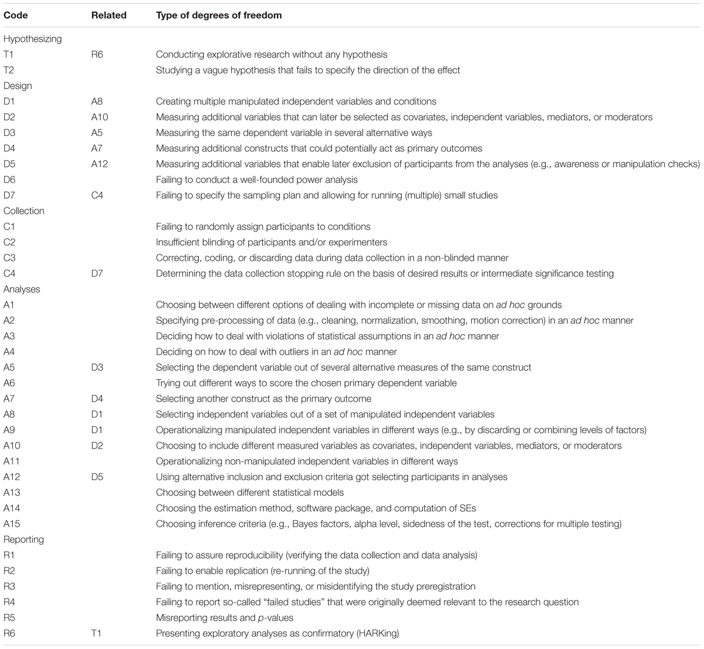

\cleardoublepage 
# (APPENDIX) 附錄 {-} 

# 產生不良研究的操作巧門 {#QRP}

科學論文經過三百多年的演進[@csiszarPeerReviewTroubled2016]，今日的實驗報告格式與寫作規範已給研究者充分指引，在論文中簡潔表達隨機化方法與控制混淆變項的措施，清晰呈現研究過程如何更新知識，是一般認為好研究應該有的基本條件。然而行之有年的評審系統，加上大量實驗研究以統計的顯著性考驗(significance testing)評估實驗結果是否符合預期，心理學與許多依賴統計分析資料的研究領域一樣，發展出許多讓報告看似大幅更新知識，實際結果經不起考驗的操作巧門。這些取巧性質的操作被稱為待澄清的研究操作(Questionable Research Practices)[@johnMeasuringPrevalenceQuestionable2012]，或者研究者的操作自由度(Researcher Degrees of Freedom)[@wichertsDegreesFreedomPlanning2016]。

以下採用 @wichertsDegreesFreedomPlanning2016 整理的各種巧門(圖 \@ref(fig:DF-checklist) )，搭配第一單元說明的知識循環，說明各環節導致研究品質低落的巧門。認識這些巧門，就能理解提昇心理學知識品質的正確作法應該是什麼。

(\#fig:DF-checklist)研究彈性檢核表。取自Wicherts et al.(2016)

## 在問題與假設之間 {#bad_QH}

能被測試的假設來自明確陳述因果關係的問題，科學家的主要任務就是察覺這類問題並轉化為假設。察覺問題的能力需要從動手操作與大量閱讀並寫作培養，實驗研究法學習的是建立假設之後，如何設計有效的實驗，與分析出能證實或否證假設的結果。所以如果同學在這項課程獲得不錯的學習成就，是顯示你有進行科學研究的潛力，要成為有獨立思考能力的科學研究者，還需要個人努力加上掌握動手操作的機會。

然而有些資深研究者判斷探討一項因果關係值不值得研究，可能會依賴個人直覺，而輕忽研究文獻的資訊不足。這樣這設計出來的研究是為了找出有因果關係的假設，而非為了確認假設的因果關係，@wichertsDegreesFreedomPlanning2016 認為這是一種**空頭假設**(T1: Conducting explorative research withut any hypothesis)，最近的例子如在人格與社會心理學期刊發表超感知覺研究的 @bemFeelingFutureExperimental2011 。這個論文收錄九個實驗，都是來自研究者猜測只要訊息有料，就能誘發人類預測未來能力的粗略想法。

還有一種巧門就如之前討論的 @williamsExperiencingPhysicalWarmth2008 ，雖然假設的預測有可能成真，但是一開始研究者並不敢保證實驗結果會如何發展，收集資料過程中不斷期待符合假設的資料出現。@wichertsDegreesFreedomPlanning2016 稱呼這種巧門**牆頭草假設**(T2: Studying a vague hypothesis that fails to specify the directoin of the effect)。

這兩類假設充斥於許多小樣本研究，或者探討大量變項的研究之中。要辨識出來除了豐富的閱讀經驗，還要洞察假設與知識循環裡每個環節的關係。

## 在假設與方法之間 {#bad_HM}

實驗研究法第一個學習門檻是把假設轉化為可執行的設計，也就是在多數心理學教科書必然提到的獨變項、依變項、中介變項、混淆變項等專有名詞，如何辨識這些變項在一項實驗裡的功能？只要先把握一個原則：所有可做實驗的假設必然指向我們想測試的因果關係，獨變項是關鍵原因的隨機化操作版本，依變項是預期能見證觀察結果的測量尺度。許多實驗研究法教科書稱呼兩種變項與假設的關係為**操作型定義**。

中介變項是會影響觀察結果，但不見得能隨機化操作的變項，很多社會心理學與偏應用性質的研究，常有與獨變項有高度相關的中介變項，必須藉重共變數分析一類的程序，才能正確評估獨變項造成的效果。混淆變項是與因果關係無關，但沒有控制好就會導致依變項測量偏差的因素。一個被多數科學家接受的知識要經歷多次更新循環的淘洗，才有啟發新世代建立新知識的價值。但是心理學進入科學方法的時間不過一百來年，為何今天各種大部頭教科書有近五百頁的內容塞進同學的腦袋？這就要談一談許多研究者認為好好使用能有助研究，卻可能降低品質的設計巧門。

- 獨變項

假設描述的原因越清楚，研究者就越了解需要多少獨變項，以及獨變項之中的處置差異。例如認知心理學與社會心理學常用的促發程序，這種獨變項有讓參與者接觸預期誘發目標行為的促發物，以及不會誘發目標行為的促發物。只要研究者認為任何中介變項與混淆變項都能在過程中妥善控制，設定一種獨變項就是充分的設計。

採用**空頭假設**與**牆頭草假設**設計實驗的研究者很愛使用兩種巧門：第一種是**多多益善**(D1:Creating multiple manipulated independent variables and conditions)，任何可以隨機化操作的處置都納入研究的獨變項，即使這項處置與原先預期的因果關係毫無關聯。第二種是**養兵千日**(D2:Measuring additional variables that can later be seleted as covariates, independent variables, mediators, or moderators)，無法隨機化操作但能測量的相關條件，都儘可能的收集資料。如果有嚴講的計畫，這兩種巧門是評估中介變項影響，與控制混淆變項的好方法。萬一分析資料時採用不良的方式，才會造就的不可信結果。

- 依變項

一個良好的操作型定義宣告明確的測量尺度，例如前面提到的促發程序，最適當的依變項是表現目標行為的人數比例。然而心理學有許多要觀察的現象，無法只用單一尺度測得所有。例如焦慮感，很多研究會收集參與者自陳報告，以及各種非侵入方式測得的生理訊號紀錄。缺乏明確的操作型定義，研究者只想盡可能地收集所有可測量的反應資料，這種操作巧門被稱為**無所不量**(D3: Measuring the same dependent variable in several alternative ways)。另一種狀況是觀察的現象不只有一種依變項，例如學生的學習成效，可以是學校科目的學習成績，授課教師的觀察陳述，研究人員的晤談紀錄等等。如果操作型定義未指明是那一種依變項是最關鍵的測量尺度，研究者也是盡可能完全收集所有反應資料，這類巧門被稱為**量盡測絕**(D4: Measuring additional constructs that could potentially act as primary outcomes)。

與獨變項一樣，萬一分析資料的方法不夠嚴謹，就會造成無法重現的結果。

- 極端值處置

有時候參與者出於非自願或其他因素，無法依照實驗指示進行反應。像是需要參與者保持專注的實驗，因為參與實驗時身心狀況過於疲憊，做出較多錯誤反應，導致反應表現離平均值超過三個標準差。當研究計畫登錄這種資料應該排除在外的原則，就可以根據測量的分析資料排除之。

本書主張極端值處置必然是操作型定義的一部分，如此就能呈現用**空頭假設**與**牆頭草假設**做研究的人員很容易使用的巧門**有備無患**(D5: Measuring additional variables that enable later exclusion of participants from the analyses)：研究人員並不是用預設的依變項資料判別極端值，而是用與關鍵測量無關的其他資料，判斷是否要排除參與者。近年引發議論的社會心理學權力姿勢效應研究[@carneyPowerPosingBrief2010]，就有這類型的操作[@carneyMyPositionPower2016]。

- 樣本數規劃

「現實中的知識更新進程」我曾經用分析房價的例子，比喻心理學研究人員通常不了解如何決定樣本人數的狀況。在我還是研究生的西元2000年前後，一直都是根據資深研究者的經驗，決定每次實驗應該收集的人數。或者根據前置研究(pilot study)的結果，判斷正式實驗應收集的人數。直到最近幾年，學到這些做法會改變研究者對型一錯誤率的初始估計[@albersWhenPowerAnalyses2018]，導致錯誤的結論。這種只憑未詳細歸納的經驗，未在收集資料前設定樣本數的操作方式，被稱為**且戰且走**(D7: Failing to specify the sampling plan and allowing for running (multiple) small studies.)

@wichertsDegreesFreedomPlanning2016 提到多數經傳統科學訓練養成的心理學者，接受**且戰且走**的研究操作為常態，是因為不了解設計變項結構要考慮發現顯著結果時的考驗力水準。如何估算符合變項結構的考驗力水準，我會在第\@ref(case)章以範例說明。在此我繼續用評估房價的例子，解說低估考驗力會帶來什麼麻煩：如果我做出北部房價比南部房價高的結論，是基於我分析收集的房屋資訊中的百分之一，你認為我的結論可不可信？如果我的結論是基於分析了其中百分之五十的結果，也許你的信任會提高一些。但是如果我不告訴你我分析多少筆資料，你永遠無法知道我的分析結果有多高的考驗力。

許多原創性的心理學題目通常沒有太多的資訊可估算考驗力水準，而且過去的統計教學也不重視考驗力的估計，培養出來的研究者設計的研究計畫自然**根基不穩**(D6: Failing to conduct a well-founded power analysis)。寫作本書的目標之一正是要改善這樣的積習。

## 在收集資料的過程裡 {#bad_D}

變項結構與設定直接決定資料收集的方式與應該避免的失誤，不僅是計畫書要說清楚收集資料的操作，也要載明收集過程的紀錄方式。

隨機分派(Random Assignment)是實驗研究首要影響結果品質的操作措施。一般的實驗分派方式有參與者間與參與者內兩種，參與者間分派配合獨變項有實驗組與控制組的設定，例如之前提過社會心理學實驗的促發程序。參與者間分派通常與場地安排有關，有賴實驗人員的臨場調度，實驗紀錄成為研究進行中確認操作正確，與事後檢核的依據。認知心理學的促發程序通常使用參與者內隨機分派，因為參與者會經歷所有獨變項狀況的刺激項目。今日許多參與者內分派實驗已經程式化，研究人員應公開程式碼，讓報告讀者檢視分派程序的正確性。有些研究的實驗結果一直存在爭議，很有可能是**分派失誤**(C1: The failure to randomly assign participants to conditions)所造成，但是研究者若不公開紀錄資料，任何人都無法確認真正原因。

獨變項操作與場地情境有關的心理學實驗，幾乎都需要採取至少單盲(Single Blinding)措施，即實驗結束前必須對參與者隱暪現場安排的原因，避免參與者主觀地配合或避開實驗操作。可能會被實驗者偏誤影響實驗，甚至需要雙盲(double blinding)措施，即實驗者知道即將實施的操作被預期造成的效果，收集資料過程中會有意或無意提示參與者做反應的方式。這些措施都需要在報告中說明，如果沒有說明或者說明確未確實執行，就變成**隱瞞失效**(C2: Insufficient blinding of experimenters and/or participants)。

還有一種收集資料過程中會遇到的瑕疵作為，有時與學術倫理經常談論的偽造與篡改資料問題很難區分。 @wichertsDegreesFreedomPlanning2016 所提的狀況是研究並未或無需採用雙盲措施，但是這個研究只有**空頭假設**或**牆頭草假設**，實驗者根據個人感受剔除某些參與者的反應資料，或者在評量分數做些調整。這與**李代桃僵**不同的是，只看關鍵依變項的測量結果，就做各種無根據的數據調整，這種有瑕疵的操作被稱為**矯枉過正**(C3: Correcting, coding, or discarding data during data collection in a non-blinded manner)。

最後一種瑕疵作為伴隨**且戰且走**發生。由於研究建立在**空頭假設**或**牆頭草假設**，研究者特別在意會不會發現統計顯著的結果，因此採取收到幾個參與者就做一次統計分析的策略。第\@ref(case)章我會談到，這種分析會導致型一錯誤率偏離預設，即使最後出現顯著結果，也無法確認是不是發現真正的效果。這種瑕疵操作被稱為**邊走邊看**(C4: Determining the data collection stopping rule on the basis of desired results or intermediate significance testing)。

## 在分析資料的過程裡 {#bad_A}

分析資料是整合一連串工序的作業，生物醫學領域為求資料分析的正確性，發展出三盲設計：分析資料團隊獨立於資料收集團隊，分析工作在只了解變項結構但不知道編碼意義的情況下進行。藉著 @wichertsDegreesFreedomPlanning2016 的整理，任何心理學實驗資的資料分析大致要經過四套工序，以下介紹並說明每個工序會出現的瑕疵操作。

- 原始資料處理

幾乎所有統計學與研究方法教科書未充分說明如何處理原始資料，一般論文最多以一段文字說明。但是原始資料的處理是整套資料分析工作的第一套工序，如果沒有謹慎處理，分析結果就會摻雜人為偏誤，導致研究結果推論失真。

原始資料處理發生失誤都是源於事前未約定如何處置遺漏值、轉換原始數值、校正偏離統計假設的資料、以及處置極端值。如果處理這些資料的規劃是收集資料完成後才開始做，就有可能變成四類失誤：**事後補洞**(A1: Choosing between different options of dealing with incomplete or missing data on ad hoc grounds)；**事後清洗**(A2: Specifying pre-processing of data (e.g., cleaning, normalization, smoothing, motion correction) in an ad hoc manner)；**事後校正**(A3: Deciding on how to deal with violations of statistical assumptions in an ad hoc manner)；**事後處置**(A4: Deciding on how to deal with outliers in an ad hoc manner)。

- 依變項

依事前規劃完成原始資料處理之後，接著是著手依變項資料的檢查。只要事前操作型定義已指定依變項與測量尺度，根據預期規模，以描述統計就能檢查收集到的資料完整度。

在設計一節談到的巧門**無所不量**，到了這步工序，如果捨棄本來設定的依變項測量，改用另一套收集資料過程中的測量資料，就變成有瑕疵的操作**神來一筆**(A5: selecting the dependent variable out of several alternative measures of the same construct)。或者把原來的測量尺度計分重新調整，造成**狸貓換太子**(A6: Trying out different ways to score the chosen primary dependent variable)。2018年就有已發表的期刊論文，因為這類瑕疵而遭到期刊主動撤稿[例如 @wansinkRETRACTEDAttractiveNames2012]。

實驗設計另一種規劃依變項的巧門**量盡測絕**，研究者事後分析已收集的潛在依變項資料，但是這些依變項並未在事先計畫詳述，只在最後報告成為分析重點。這種操作瑕疵稱為**偷天換日**(A7: Selecting another construct as the primary outcome)，教育研究等有同時收集大量測量資料的領域，研究者很容易不自覺地將這種操作當成常態科學運作。

- 獨變項

依變項的測量資料再搭配獨變項的設計編碼，資料分析工作才正式進入推論統計。這套工序的成敗取決於事前的設計結構規劃，事前規劃好，到這個步驟就會知道該用那套分析方法，才能得到正確的結論。

若是在設計實驗時採用**多多益善**，分析資料時把並非事先計畫操作的獨變項納入，這種瑕疵就是**偷梁換柱**(A8: Select independent variables out of a set of manipulated independent variables (paired with D1) )。另一種有瑕疵的操作是把原來的獨變項內分組編碼重新配置，讓組間差異擴大的手法被稱為**點石成金**(A9: Operationalizing the manipulated independent variables in different ways)。

設計實驗時對待既非操作也非測量的變項另一套巧門，**養兵千日**，進行到這裡真的拿出來用，就有機會造成兩替瑕疵。一種是把這些變項當成新的獨變項或中介變項的**用在一時**(A10: Choosing to include different measured variables as covariates, independent variables, mediators, or moderators)，使用共變數分析或迴歸分析的研究是最常出現這類瑕疵的類型。另一種則是把這些變項另做其他用途，例如事後補充性分析，這種操作稱為**無中生有**(A11: Operationalizing non-manipulated independent variables in different ways)。

- 極端資料處置

這套工序並不是必須的，當依變項測量資料搭配獨變項分析之後，如果事先計畫已提到極端值會扭曲分析結果的解讀，才有處置極端資料的必要性。反之，拿事先不重視但是有收集資料的變項做**有備無患**的準備，至此用來處置極端資料，以利結果往預期方向解讀的巧門**拋磚引玉**(A12: Using alternative inclusion and exclusion criteria got selecting participants in analyses)，就變成一種有瑕疵的操作。

- 分析結果

有事前分析規劃，也按照規劃走到這個工序，應該已經準備好要寫出那些程式碼或該用什麼軟體套件，才能達成計畫目標。如果前面任何一套工序是資料收集完成後，才想如何分析，就會造成瑕疵操作。萬一變項結構都沒有規劃清楚，像是該用獨立組比較還是重覆量數比較，該做完整迴歸還是逐步迴歸，自然發生**左右為難**(A13: Choosing between different statistical models)的困境。若是研究者缺乏基本統計知識，無法掌握分析結果的重要參數，會糾結於要用什麼軟體或估計方法處理資料的**貨比三家**(A14: Choosing the estimation method, software package, and computation of SEs)局面。即使過了這些關卡，如果沒有事先確定推論統計的解讀標準，例如顯著準是.05還是.01，最後要面臨**舉棋不定**(A15: Choosing inference criteria)的考驗。

## 在寫作報告的過程裡 {#bad_W}

最後是將實驗過程與分析結果寫入完整報告。一份科學研究成果要能被他人採用相同程序收集與分析資料，驗證結果的真實性。不僅是文字的描述，最好能公開實驗材料與編碼資料的說明等，這次研究結果才不會**獨一無二**(R2: Failing to enable replication (re-running of the study))。分析資料的所有工序能留下規劃書與程式碼，使報告中的結果推論有憑有據，避免**查無實證**(R1: Failing to assure reproducibility (verifying the data collection and data analysis))的疑慮。

以**空頭假設**發展的研究計畫最後做出來的結果，如果可以揭露值得測試的方向，不完全沒有科學價值。但是研究者意圖給予一種因果關係的解釋，就變成**事後諸葛**(R6: Presenting exploratory analyses as confirmatory (HARKing))，嚴重者會引導其他研究者虛擲研究資源於不一定能產生真實知識的更新循環。

研究者如果無法抗拒呈現因果關係的企圖心，就算不做**事後諸葛**，也會使用寫作技巧美化報告結果。最常用的是直接修改事先根據文獻回顧做的假設預測，寫出言之成理，其實**前後不一**(R3: Failing to mention, misrepresenting, or misidentifying the study preregistration)的研究報告。另一方面，若是要分析的資料變項很多，只要不報告一部分分析結果，就能讓分析看以支持結論，研究者會無法抗拒讓這些結果**不見天日**(R4: Failing to report so-called “failed studies” that were originally deemed relevant to the research question)的誘惑。

最後一種是統計知識不足的研究者會發生的失誤**指鹿為馬**(R5: Misreporting results and p-values)：由於計算失誤或不知如何正確解讀統計結果，導致錯誤的結論。你也許覺得本書太吹毛求疵，但是確實有任教於常春藤聯盟知名大學的心理學者，在發表的論文裡被發現這樣的錯誤[@cuddyThisOldStereotype2005]。
